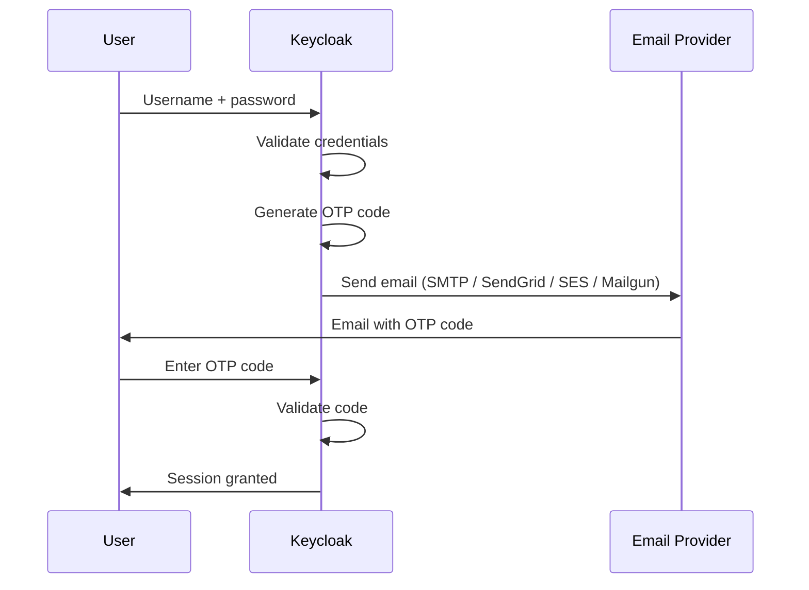

# Keycloak 2FA Email Authenticator

A professional Keycloak Authentication Provider implementation for two-factor authentication (2FA) using One-Time Passwords (OTP) delivered via email. Supports multiple email providers: Keycloak SMTP, SendGrid, AWS SES, and Mailgun.

[](https://central.sonatype.com/artifact/io.github.mesutpiskin/keycloak-2fa-email-authenticator)
[](https://adoptium.net/)
[](https://github.com/mesutpiskin/keycloak-2fa-email-authenticator/blob/main/LICENSE)

## Overview

This Keycloak extension enables email-based two-factor authentication by sending a verification code (OTP) to the user's registered email address during login. The authenticator integrates seamlessly with Keycloak's authentication flow system.

**Key capabilities:**

- Send OTP codes via multiple email providers
- Flexible provider selection with automatic fallback to Keycloak SMTP
- Fully customizable email templates (HTML + text)
- Conditional authentication flow support
- Works with Keycloak's built-in flow builder

## Features

| Feature                                                            | Status |
| ------------------------------------------------------------------ | ------ |
| Email-based OTP authentication                                     | ✅     |
| Multiple email provider support (SMTP, SendGrid, AWS SES, Mailgun) | ✅     |
| Automatic fallback to Keycloak SMTP                                | ✅     |
| SendGrid API key authentication                                    | ✅     |
| AWS SES with IAM credentials and region support                    | ✅     |
| Mailgun REST API with US/EU region support                         | ✅     |
| Customizable email HTML templates                                  | ✅     |
| Conditional authentication flows                                   | ✅     |
| Multi-stage Docker build                                           | ✅     |
| Keycloak 26.x compatible                                           | ✅     |
| 11 built-in language translations                                  | ✅     |

## How It Works

Once installed and configured, the authenticator adds a second step to Keycloak's login flow:

1. **User submits username + password** — standard Keycloak first factor
2. **OTP code is generated** — a time-limited numeric code is created server-side
3. **Email is sent** — the code is delivered via your chosen provider (SMTP, SendGrid, AWS SES, or Mailgun)
4. **User enters the code** — a verification form appears in the browser
5. **Code is validated** — on success, the session is established; on failure, the user can retry or request a new code



The authenticator integrates as a standard Keycloak SPI, so it works alongside any existing authentication policies, conditional flows, and realm settings.

## Prerequisites

### Local Build

- **Java 21+** — [Download from Adoptium](https://adoptium.net/)
- **Maven 3.9+** — [Download from Apache](https://maven.apache.org/download.cgi)

### Docker / Podman

- **Docker** — [Download](https://www.docker.com/) or **Podman** — [Download](https://podman.io/)
- (Optional) Docker Compose or Podman Compose

## Install via Maven Central

The easiest way to get the JAR — no build required:

```xml title="Maven"
<dependency>
  <groupId>io.github.mesutpiskin</groupId>
  <artifactId>keycloak-2fa-email-authenticator</artifactId>
  <version>26.4.0-KC26.6.1</version>
</dependency>
```

```groovy title="Gradle"
implementation 'io.github.mesutpiskin:keycloak-2fa-email-authenticator:26.4.0-KC26.6.1'
```

:::tip Version format
`<plugin-version>-KC<keycloak-version>` — e.g. `26.4.0-KC26.6.1` targets Keycloak 26.6.1.
Browse all versions on [Maven Central](https://central.sonatype.com/artifact/io.github.mesutpiskin/keycloak-2fa-email-authenticator).
:::

## Resources

- [Keycloak Server Development Guide](https://www.keycloak.org/docs/latest/server_development/index.html)
- [Keycloak Official Website](https://www.keycloak.org/)
- [Maven Central — all versions](https://central.sonatype.com/artifact/io.github.mesutpiskin/keycloak-2fa-email-authenticator)
- [GitHub Repository](https://github.com/mesutpiskin/keycloak-2fa-email-authenticator)
- [Issue Tracker](https://github.com/mesutpiskin/keycloak-2fa-email-authenticator/issues)

## Next Steps

import DocCardList from "@theme/DocCardList";

<DocCardList />
